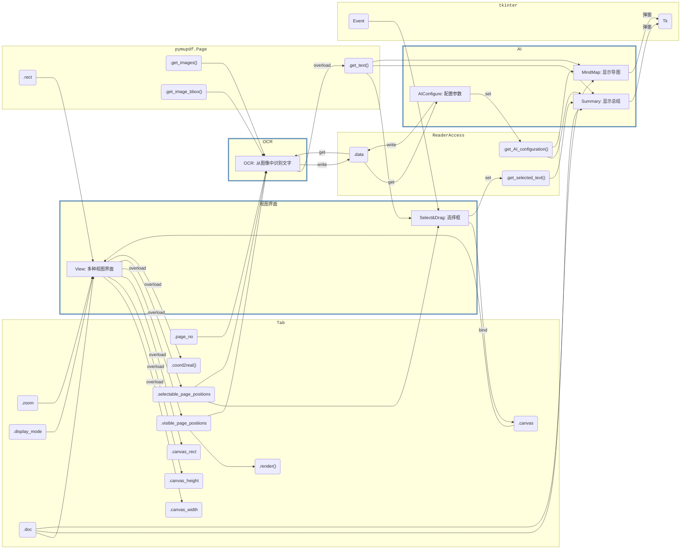

# 第二周分工

## 插件关系图

## 需求文档

**视图界面**：

-  [View.md](View.md) 
-  [Select&Drag.md](Select&Drag.md) 

**OCR**：

-  [OCR.md](OCR.md) 

**AI**：

- [AIConfigure.md](AIConfigure.md) 
- [Summary.md](Summary.md) 
- [MindMap.md](MindMap.md) 
