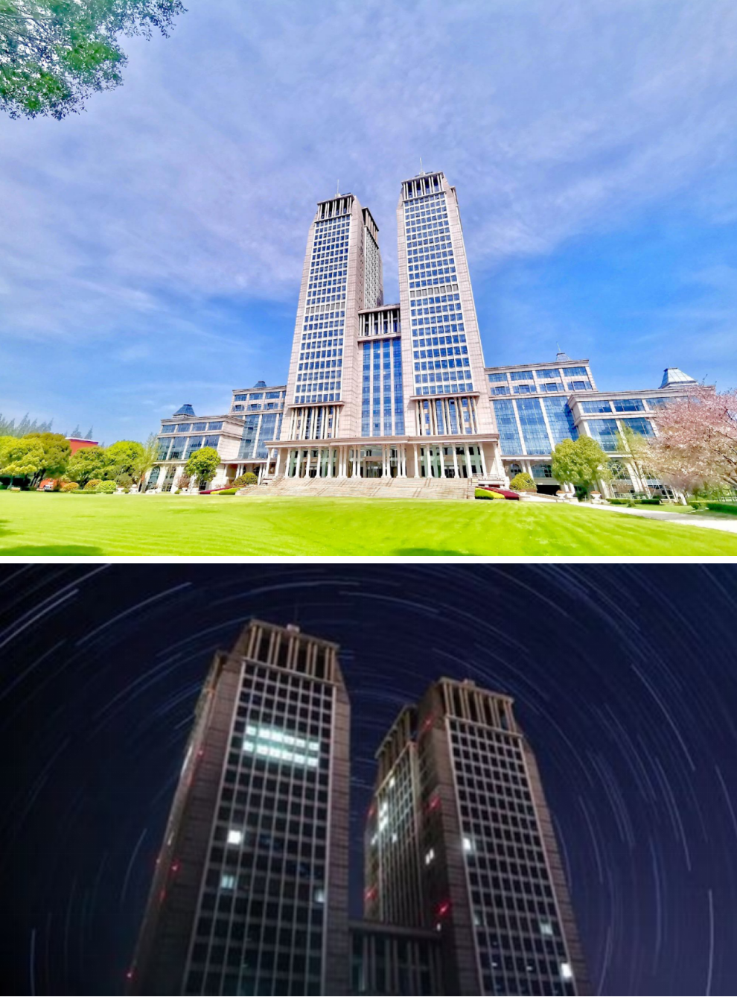
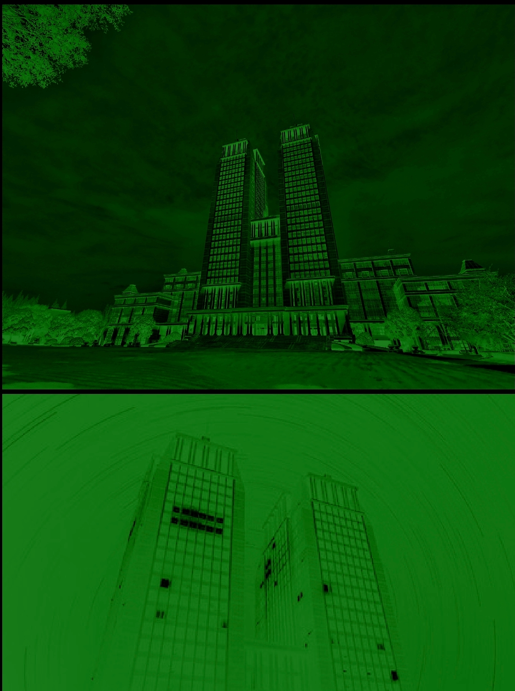

# 多样化主题切换的可能实现方案

by Jerry

以下讨论如何根据不同的主题渲染 PDF。

## 概述

将渲染的内容分为三部分：

- 背景。
- 文字。
- 图像。

以下是不同主题的渲染方式：

| 主题   | 背景   | 文字   | 图像     |
| ------ | ------ | ------ | -------- |
| 白天   | 原色   | 原色   | 原色     |
| 夜晚   | 黑色   | 白色   | 反色     |
| 自定义 | 背景色 | 文字色 | 线性映射 |

## 自定义转换公式

下面解释自定义情况下的图像渲染方式（即上表中的“线性映射”）：

1. 设 RGB 单色的取值范围为 $I = \{ 0, 1, 2, \cdots, 255 \}$ 。一个 RGB 值可以表示为一个三元向量 $\vec{c} = (R, G, B) \in I^{3}$ 。记：

    - $\vec{0} = (0, 0, 0) \in I^{3}$ 为零向量（黑色）；

    - $\vec{1} = (1, 1, 1)$ 为全1向量；

    - $\vec{w} = (255, 255, 255) \in I^{3}$ 为白色；

    - $\vec{u} = (256, 256, 256)$ 用作取不到的边界。

2. 构造映射：
    $$
    \begin{aligned}
    \vec{f}: [0, 1) & \to I^{3} \\
    \vec{f}(t) & \mapsto \lfloor \vec{0} + t (\vec{w} + \vec{1} - \vec{0}) \rfloor = \lfloor t \vec{u} \rfloor \in I^{3}
    \end{aligned}
    $$
    其中：

    - $\lfloor ~ \rfloor$ 表示对向量中的每个元素向下取整：
        $$
        \lfloor \vec{v} \rfloor = \lfloor (v_{1}, v_{2}, \cdots, v_{n}) \rfloor = (\lfloor v_{1} \rfloor, \lfloor v_{2} \rfloor, \cdots, \lfloor v_{n} \rfloor)
        $$

    对这个映射的直观理解是：当 $t$ 从 0 连续地变成 1 （不含）时， $\vec{f}(t)$ 也“连续”地从 $\vec{0}$ （黑色）变成了 $\vec{w}$ （白色），中间过程是灰色。

    记 $\vec{f}$ 的反函数为 $f_{i} = \vec{f}^{-1}: I^{3} \to [0, 1)$ ，则 $f_{i}$ 的功能是将一个灰度值映射为 $[0, 1)$ 中的一个值。灰度值 $\vec{c}$ 越深， $f_{i}(\vec{c})$ 就越接近 $0$ 。

3. 设文字色（RGB）为 $\vec{c}_{0} = (R_{0}, G_{0}, B_{0}) \in I^{3}$ ，背景色（RGB）为 $\vec{c}_{1} = (R_{1}, G_{1}, B_{1}) \in I^{3}$ ，记该自定义颜色组为 $(\vec{c}_{0}, \vec{c}_{1})$ 。

    构造映射：
    $$
    \begin{aligned}
    \vec{g}: [0, 1] & \to I^{3} \\
    \vec{g}(t) & \mapsto \lfloor \vec{c}_{0} + t (\vec{c}_{1} + \vec{1} - \vec{c}_{0}) \rfloor \in I^{3}
    \end{aligned}
    $$
    对这个映射的直观理解是：当 $t$ 从 0 连续地变成 1 时， $\vec{g}(t)$ 也“连续”地从 $\vec{c}_{0}$ （文字色）变成了 $\vec{c}_{1}$ （背景色）。

4. 将原图像进行“灰度”处理，设某个像素点的灰度值为 $\vec{c}$ ，则这个像素点在颜色组 $(\vec{c}_{0}, \vec{c}_{1})$ 下的像为 $\vec{c}'$ ：
    $$
    \vec{c}' = \vec{g}(f_{i}(\vec{c}))
    $$
    对这个变换的直观理解是：将原图像中的深色映射到靠近文字色，将原图像中的浅色映射到靠近背景色。

## 效果演示

原图像：

在颜色组 $((0, 0, 0), (60, 123, 44))$ （即，背景色为黑色■，文字色为绿色■）下显示为：

> [!NOTE]
>
> 这个方法是我观察了 ReadEra 的主题切换后总结出来的。欢迎大家提出更好的方案！